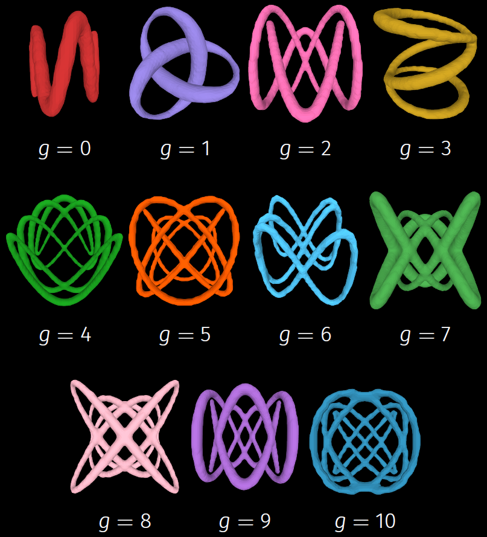

# Benchmark for the EuLearn database

This repo contains the benchmark deep learning architectures that were trained and evaluated on the following database:

[EuLearn: A 3D database for learning Euler characteristics](https://huggingface.co/datasets/appliedgeometry/EuLearn)
