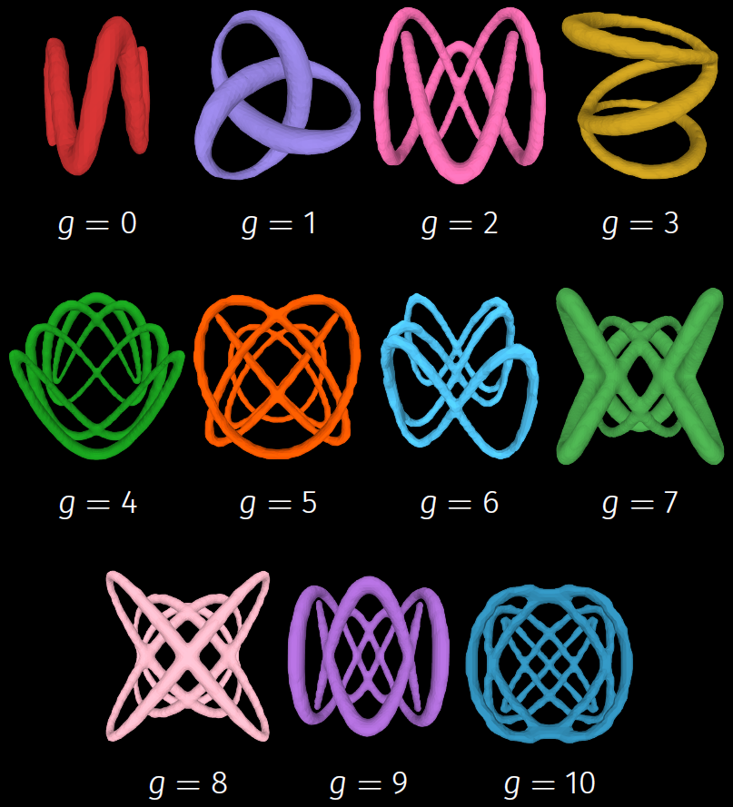
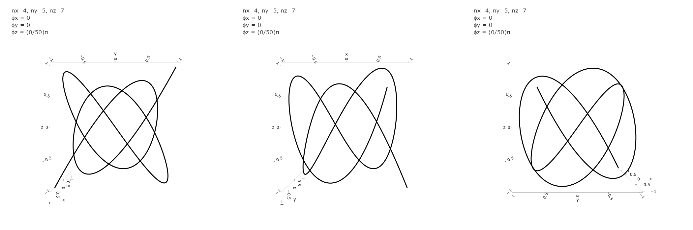
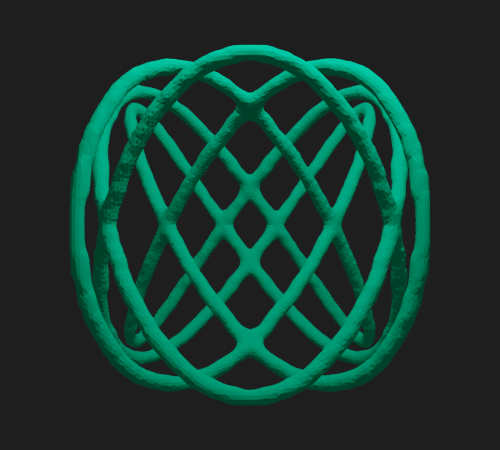

<h1 align="center">EuLearn</h1>
<br>

<p align="center">

</p>
<p align="center">
  <em>Figure 1. Representative EuLearn surfaces spanning topological genera 0 through 10.</em>
</p>
<br>

This repo contains the code to generate EuLearn surfaces and the geometric deep learning architectures that were trained and evaluated on [EuLearn: a 3D database for learning Euler characteristics](https://huggingface.co/datasets/appliedgeometry/EuLearn)

[Database Generator](DatabaseGenerator) contains the software used to generate EuLearn surfaces from scalar fields via the Marching Cubes algorithm.

[Architectures](Architectures) hosts the geometric deep learning models that perform implicit topological data analysis by learning topological invariants from geometric data.

The [Sampling](Sampling) folder contains the 3k-vertex point clouds sampled from the benchmark EuLearn dataset. This sampling procedure was used to train the benchmark architectures.
<br><br>

<p align="center">

</p>
<p align="center">
  <em>Figure 2. Continuous deformation of the Lissajous singular knot (4,5,7) induced by a sweep of the z-coordinate phase parameter.</em>
</p>
<br><br>

<p align="center">

</p>
<p align="center">
  <em>Figure 3. EuLearn surface generated from the Lissajous singular knot (4,5,7) with phase parameter φz = π/2.</em>
</p>
<br>

## Citation

If you use EuLearn in your research, please cite:

```
Pablo Suárez-Serrato, Rodrigo Fritz, Víctor Mijangos, Anayanzi Martínez, Eduardo Velázquez Richards.
«EuLearn: a 3D database for learning Euler characteristics»
Machine Learning: Science and Technology (2026).
http://iopscience.iop.org/article/10.1088/2632-2153/ae622e
```

You can also copy-paste the BibTex citation:

```bibtex
@article{Suárez-Serrato_2026,
  doi = {10.1088/2632-2153/ae622e},
  url = {https://doi.org/10.1088/2632-2153/ae622e},
  year = {2026},
  month = {may},
  publisher = {IOP Publishing},
  volume = {7},
  number = {3},
  pages = {030601},
  author = {Suárez-Serrato, Pablo and Fritz, Rodrigo and Mijangos, Victor and Martínez, Anayanzi and Velazquez Richards, Eduardo},
  title = {EuLearn: a 3D database for learning Euler characteristics},
  journal = {Machine Learning: Science and Technology}
}
```
